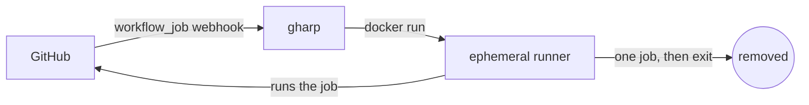

# 🪉 gharp — GitHub Actions Runner Pool

A self-hosted, Docker-based pool of ephemeral GitHub Actions runners.

## ✨ Features

* 🔐 **Self-hosted** — no external service dependency
* ♻️ **Ephemeral runners** — one job per runner, clean environment every time
* ⚡ **Autoscaling** — runners are created on-demand from webhook events
* 📦 **Multi-repository, personal-account support** — share compute across repos (not supported natively by GitHub)

## 🚀 Quick Start

### 1. Run gharp

Pre-built multi-arch image: [`muhac/gharp`](https://hub.docker.com/r/muhac/gharp).

```bash
docker run -d --name gharp \
  -p 8080:8080 \
  -e BASE_URL=https://gharp.example.com \
  -v /var/run/docker.sock:/var/run/docker.sock \
  -v /tmp/gharp:/tmp/gharp \
  -v gharp-data:/data \
  muhac/gharp:latest
```

`BASE_URL` must be a public HTTPS URL GitHub can reach. See
[`docs/configuration.md`](docs/configuration.md) for the full env-var
reference (labels, GHES base, runner image, etc.).

### 2. Create the GitHub App

Open `${BASE_URL}/setup` and click **Create GitHub App**. gharp drives
the GitHub App Manifest flow and persists the credentials locally.

> ⚠️ **Don't rename the auto-generated App name on GitHub.**
> gharp creates the App as `gharp-<hash>`; renaming it changes the slug,
> which breaks the install link gharp renders on `/setup`.
> The webhook keeps working — only the install link goes stale.
> To fix, delete the App on GitHub and re-run `/setup`.

> ⚠️ **`BASE_URL` is sticky.** It's baked into the GitHub App's webhook
> and OAuth-callback URLs at `/setup` time. Changing it later won't
> reconfigure the App — gharp will log a `BASE_URL drift` warning at
> startup. To migrate, re-run `/setup` (creating a fresh App) or revert
> `BASE_URL` to the original value.

### 3. Install the App

Pick the repos (or "All repositories") you want runners for and submit.

> ⚠️ **Self-hosted runners + public repos = remote code execution.**
> GitHub [explicitly recommends against](https://docs.github.com/en/actions/how-tos/manage-runners/self-hosted-runners/add-runners)
> using self-hosted runners with public repositories: any contributor
> who can open a PR can run arbitrary code on your machine.
> Only install the App on **private** repos you trust,
> and run gharp on a **dedicated VM / cloud instance / homelab node**.

### 4. Add a workflow

```yaml
jobs:
  build:
    runs-on: [self-hosted]
    steps:
      - uses: actions/checkout@v4
      - run: echo "hello from ephemeral runner"
```

Every `workflow_job` whose `runs-on` set intersects `RUNNER_LABELS`
(default `self-hosted`) will get a fresh runner.

For production deployments (compose, Cloudflare Tunnel / ngrok /
Tailscale Funnel, volumes, upgrades, troubleshooting, from-source
build), see [`docs/deploy.md`](docs/deploy.md).

## 🤔 Why?

GitHub does **not support "user-level" runners**.

* Runners are scoped to: repository, organization, or enterprise

This makes it hard to:

* share a runner across multiple repositories
* use self-hosted runners efficiently in personal accounts
* scale runners dynamically

💡 **This project solves that**

* Uses **GitHub App + webhook (`workflow_job`)**
* Dynamically creates **ephemeral runners per job**
* Automatically cleans up after execution

👉 You get **GitHub-hosted-like behavior on your own machine**

## 🏗️ Architecture



See [`docs/architecture.md`](docs/architecture.md) for the full design,
including the GitHub App Manifest flow, sqlite job durability, and
permission scopes.

## 📦 Tech Stack

* Go (server)
* Docker (runner execution)
* GitHub App (auth + webhook)

## 📄 License

Apache License 2.0

## ⭐ If this helps you

Give it a star — it helps others discover the project!


## 🙌 Acknowledgements

* [GitHub Actions](https://docs.github.com/en/actions) / [self-hosted runners](https://docs.github.com/en/actions/concepts/runners/self-hosted-runners)
* [Docker Github Actions Runner](https://github.com/myoung34/docker-github-actions-runner)
