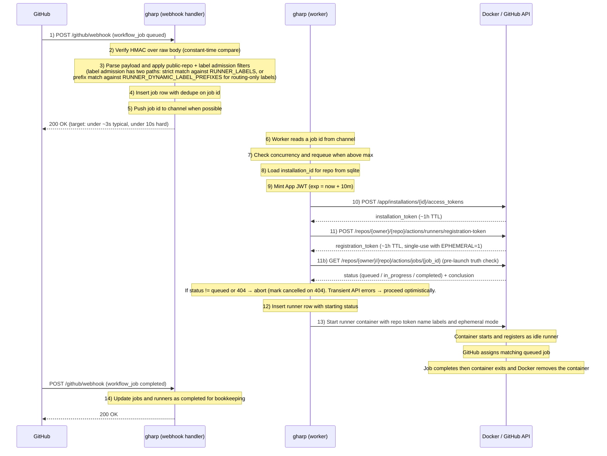
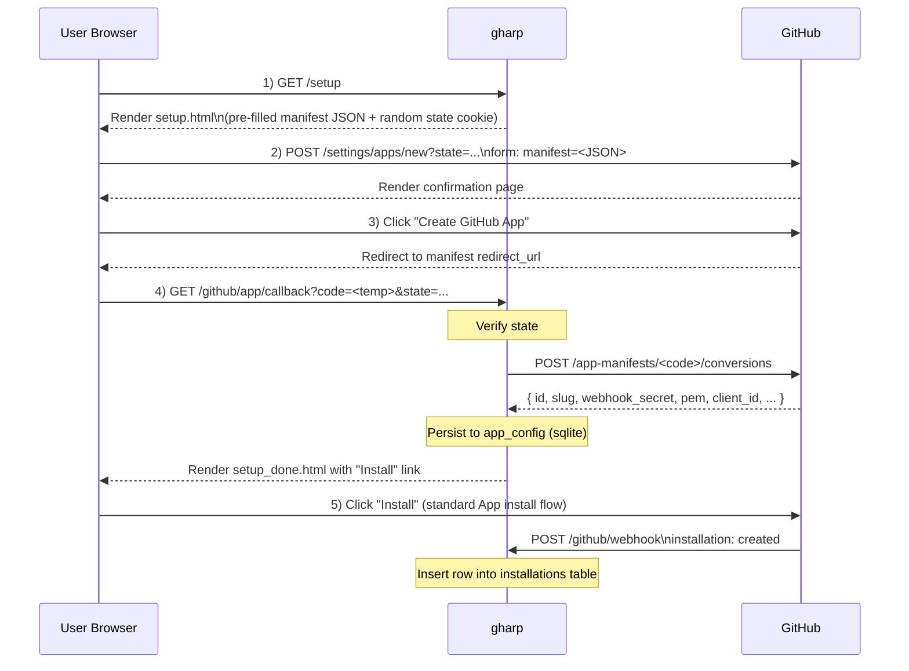

# Architecture

> Design decisions for `actions-runner-pool` (binary: `gharp`).

## Goals

- Run **ephemeral, autoscaling** GitHub Actions runners.
- Serve **multiple repositories** under a **personal GitHub account** — filling the gap left by GitHub's repo/org/enterprise-only runner scopes.
- **Single-machine, Docker-based.** No Kubernetes, no external scheduler, no SaaS dependency.
- **Single binary, modular layout.** Easy to understand on day one; easy to split into control-plane / worker later if needed.

Non-goals (for v1):
- Multi-node deployment.
- gRPC / public API.
- Kubernetes integration (ARC already owns that space).

## High-level flow

```text
GitHub
  │   workflow_job (queued)
  ▼
┌─────────────────────────────────────────────────────────────┐
│  gharp (single Go binary)                                   │
│                                                             │
│  webhook handler                                            │
│    ├─ verify HMAC (X-Hub-Signature-256)                     │
│    ├─ parse workflow_job payload                            │
│    ├─ persist job row (sqlite)                              │
│    ├─ push to in-process channel                            │
│    └─ return 200 OK  ◄── must be fast (GitHub 10s timeout)  │
│                                                             │
│  worker goroutine(s)                                        │
│    ├─ pop from channel                                      │
│    ├─ dedupe / concurrency check                            │
│    ├─ get installation token (GitHub App JWT → install tok) │
│    ├─ register repo runner → get registration token         │
│    └─ docker run myoung34/github-runner (EPHEMERAL=1)       │
│                                                             │
└─────────────────────────────────────────────────────────────┘
                          │
                          ▼
                  ephemeral container
                  (one job, then exit)
```

## Key design decisions

### 1. Single binary, modular packages

One Go binary (`gharp`) keeps deployment trivial: `docker compose up`. Internal package boundaries are drawn so that a future split into a control plane + worker daemon is mechanical, not a rewrite.

### 2. Webhook-to-worker = sqlite + in-process channel

The webhook handler does the **minimum** work synchronously, then hands off:

1. Verify HMAC signature on the raw request body.
2. Parse the `workflow_job` event.
3. Insert a job row into sqlite (the durable record — survives crashes).
4. Push the job ID onto a buffered Go channel.
5. Return `200 OK`.

A single worker goroutine (or a small fixed pool) reads the channel and does the slow work: API calls, container launches.

**Why this shape:**
- GitHub gives webhook handlers ~10 seconds before retrying. Pulling a Docker image or registering a runner can blow that budget. Decoupling makes the response time bounded.
- sqlite as the durable record means a crash mid-job doesn't lose the event — on restart, the worker can replay un-finished jobs.
- An in-process channel is enough for v1. No Redis, NATS, or external broker. If we ever need multi-node workers, this is the seam to swap.

### 3. sqlite from day one

Not flat files. sqlite gives transactions, indexed queries, and proper concurrent reads cheaply. Cost is one CGO-free dependency (`modernc.org/sqlite` or similar).

Tables (initial cut):

- **`app_config`** — App ID, webhook secret, private key, BASE_URL. One row.
- **`installations`** — installation ID, account login, account type, scope.
- **`jobs`** — workflow_job ID, repo full name, action (queued/in_progress/completed), labels, dedupe key, received_at, status. The status state machine is `pending` → `dispatched` (gharp launched a runner; GitHub hasn't bound it yet) → `in_progress` (real `workflow_job: in_progress` webhook with non-empty `runner_name`) → `completed`. The `dispatched` placeholder lets the scheduler's replay loop rescue jobs whose runner lost the assignment race.
- **`runners`** — container name, repo full name, runner name, labels, status, started_at, finished_at.

### 4. Ephemeral, per-job containers

Each `workflow_job: queued` event spawns one container with `EPHEMERAL=1`. The container registers with GitHub, runs exactly one job, and exits. The default image is `myoung34/github-runner` — we don't reinvent runner registration inside the container.

#### User-supplied `docker run` command (template)

The exact command used to launch a runner is **a user-configurable template**, not hard-coded. Defaults give a working setup out of the box; users who need custom images, extra mounts, GPU, host networking, etc. provide their own template — they're self-hosting, they make the call.

The template is a **JSON array of strings** (no shell — each element is one `argv`), with Go `text/template` placeholders:

```jsonc
// Default (RUNNER_COMMAND env, or omitted)
[
  "docker", "run", "--rm",
  "--name", "{{.ContainerName}}",
  "-e", "REPO_URL={{.RepoURL}}",
  "-e", "RUNNER_TOKEN={{.RegistrationToken}}",
  "-e", "RUNNER_NAME={{.RunnerName}}",
  "-e", "LABELS={{.Labels}}",
  "-e", "EPHEMERAL=1",
  "{{.Image}}"
]
```

`{{.Image}}` defaults to `myoung34/github-runner:latest` via `RUNNER_IMAGE`. Users override the whole template via `RUNNER_COMMAND` env var (or yaml later).

#### Why JSON array, not a string template

A single-string template invites `sh -c "..."` and shell injection: `{{.RepoURL}}` expands from a GitHub payload field — GitHub-controlled, but we still don't want shell metacharacters to matter. The array form goes straight to `exec.Command(args[0], args[1:]...)`, no shell, no quoting bugs.

#### Required placeholders (startup-validated)

These five must appear *somewhere* in the template, or `gharp` refuses to start. They're load-bearing — without them, either the runner can't register or the reconciliation loop can't find what it spawned.

| Placeholder | Why required |
|---|---|
| `{{.ContainerName}}` | Reconciliation calls `docker inspect <name>` to check container liveness. Must also appear as `--name` arg. |
| `{{.RegistrationToken}}` | Runner cannot register with GitHub without it. |
| `{{.RunnerName}}` | Listed in GitHub's `/runners` API; reconciliation cross-references this with `runners` table. |
| `{{.RepoURL}}` | Tells the runner which repo to register against. |
| `{{.Labels}}` | Determines which `runs-on` jobs match. |

Validation: at `Load()`, `strings.Contains` check for each `{{.X}}` literal. Fail fast with a clear error message naming the missing placeholder.

#### Things users can do with the template

- Use a custom pre-built image with their own toolchain: just override `RUNNER_IMAGE` and don't touch the template.
- Mount a host cache directory: add `"-v", "/host/cache:/cache"` to the array.
- Use host networking: add `"--network=host"`.
- Pass GPUs: add `"--gpus=all"`.
- Use Docker-out-of-Docker: add `"-v", "/var/run/docker.sock:/var/run/docker.sock"` (with the security implications).
- Run rootless / under a different user namespace: prefix with `"sudo", "-u", "runner-user"` — though at that point we recommend a wrapper script.

#### Things users *can* break themselves (and we don't second-guess)

- Drop `EPHEMERAL=1` → runner becomes long-lived, stays after the job completes. The reconciler's `RUNNER_MAX_LIFETIME` sweep (default 2h) eventually force-removes it, but you'll burn cap slots until then. *User's call.*
- Drop `--rm` → exited containers accumulate. *User's housekeeping problem.*
- Use a non-`myoung34` image → must replicate the same env-var contract (`REPO_URL`, `RUNNER_TOKEN`, etc.) for things to work. Documented but not enforced.

#### What the worker actually does (step 13, expanded)

```text
template := config.RunnerCommand                      // []string with {{...}}
data := struct{ ContainerName, RegistrationToken, RunnerName, RepoURL, Labels, Image string }{...}
args := make([]string, len(template))
for i, tmpl := range template {
    args[i] = renderTemplate(tmpl, data)              // text/template per element
}
cmd := exec.CommandContext(ctx, args[0], args[1:]...)
cmd.Stdout, cmd.Stderr = log writers
err := cmd.Start()                                    // returns once docker daemon ack'd
```

We don't `Wait()` synchronously — `--rm` will clean the container on exit, and the lifecycle truth-of-record is webhook events (`in_progress` / `completed`) plus reconciliation. The `cmd.Start()` failure path means "couldn't even talk to docker"; container-internal failures show up as the job never transitioning to `in_progress` and the reconciliation loop noticing.

#### Runner trigger flow (webhook → running container)

This is the hot path. Everything between "GitHub fires `workflow_job: queued`" and "a container is executing the job."



#### Critical invariants

- **Verify HMAC on RAW body, before any JSON parse.** Re-serializing breaks the signature. The handler reads `r.Body` once into `[]byte`, verifies, then unmarshals from that buffer.
- **Webhook handler MUST return < 10s.** GitHub retries on timeout, which would cause duplicate work without the dedupe-on-`job_id` guard. Steps 1-5 must be cheap; everything slow lives in the worker.
- **Dedupe by `workflow_job.id`.** GitHub may deliver the same event twice (delivery retries, multiple App installations for the same repo). The `INSERT … ON CONFLICT DO NOTHING` on `jobs.job_id` is the canonical guard.
- **Channel is best-effort, sqlite is durable.** If the channel is full or the worker has crashed, the job row exists in `jobs` with `status='pending'`. On startup, the worker scans for pending jobs and re-enqueues them.
- **Registration tokens are single-use under `EPHEMERAL=1`.** Don't try to cache them. Mint one per `docker run`.
- **Installation tokens can be cached per installation for ~55 minutes** (1h TTL minus a safety margin). The `internal/github` client should hold a small in-memory cache keyed by installation_id.
- **Concurrency cap is enforced before minting tokens**, not after — otherwise we waste GitHub API budget on jobs we're about to refuse.
- **Filter early on public repos and labels.** Queued public-repo jobs are dropped by default unless `ALLOW_PUBLIC_REPOS=true` or the repo appears in `REPO_ALLOWLIST`. Lifecycle events still update already-admitted jobs. If the workflow's `runs-on` labels are not satisfiable from configured runner labels or allowed dynamic label prefixes, drop the event in step 3 — don't even insert into `jobs`. Prevents the queue filling with jobs we'll never serve.

#### What we deliberately don't do

- **No just-in-time (JIT) runner registration.** GitHub now offers JIT config tokens that bind a runner to a specific job, eliminating the race where two queued jobs could both grab the same fresh runner. We should adopt this in v1.1 — for v1, classic registration tokens + `EPHEMERAL=1` are simpler and well-understood.
- **No graceful drain on shutdown (yet).** SIGTERM stops accepting webhooks but lets running containers finish. We don't try to "transfer" pending channel items anywhere — they're already in sqlite, the next process recovers them.
- **No retry/backoff on Docker failures (yet).** If `docker run` fails, the job stays `pending` and the worker logs an error. v1.1: bounded retry with exponential backoff.

#### Runner lifecycle and the job ↔ runner drift

The model is **"one ephemeral runner per `queued` event"**, not "one runner per job assignment." These are not the same thing, and the gap is important.

When `queued` fires we don't know which runner GitHub will pick — we only know *some* runner with matching labels needs to exist. So we start one. GitHub then matches queued jobs to idle runners by label using its own scheduler; the binding is invisible to us until `in_progress` arrives carrying `runner_id` and `runner_name`.

This means:

- **Two `queued` events arriving close together start two runners.** GitHub may assign job A to runner B and job B to runner A — perfectly fine, the labels match. The mapping `job_id → runner_id` only becomes known when `in_progress` arrives.
- **Dynamic labels can narrow this race.** Jobs can include a generated label such as `gharp-build-${{ github.run_id }}-${{ github.run_attempt }}`. The webhook admits labels with configured dynamic prefixes (default `gharp-`), and dispatch registers the runner with the job's full label set, so GitHub only assigns jobs carrying that same generated label.
- **Idle runners can be claimed by jobs that arrived before they were spawned.** If a job sat queued for 30 seconds before our runner came up, the runner immediately picks it up. This is *desired* behaviour, not a bug.
- **A runner can fail to claim any job.** If three jobs are queued and we spawn three runners, but one runner finishes startup after GitHub has already assigned all three jobs to the first two (because the second runner finished both quickly), the third runner sits idle. Under `EPHEMERAL=1` an idle runner waits for a job indefinitely — which is the source of "ghost runners" if we don't intervene.

#### Event handling per `workflow_job.action`

| action | what we do | why |
|---|---|---|
| `queued` | enqueue + spawn runner (the hot path above), then `MarkJobDispatched` flips `pending → dispatched` | the trigger; the placeholder distinguishes "runner launched, awaiting binding" from a real binding |
| `in_progress` | if `runner_name == ""`, **drop the event** (a dispatch race we lost — see below); otherwise `UPDATE jobs SET status='in_progress', runner_id=?, runner_name=?` (only if currently `pending`/`dispatched`) and `UPDATE runners SET status='busy'` | first time we know which runner won the job; lets us reconcile our `runners` table with reality |
| `completed` | `UPDATE jobs SET status='completed', conclusion=?` and `UPDATE runners SET status='finished', finished_at=?`. Container is already `--rm`-ing itself. | bookkeeping; no new docker action |

The `runner_name == ""` skip exists because GitHub sometimes fires `in_progress` for a job that gharp's launched runner *did not* claim (e.g., a different runner won the assignment, or the binding hadn't been written when GitHub generated the event). Without the skip, the row would advance to `in_progress` with an empty binding, completed by no one, and the replay loop couldn't rescue it. With the skip, the row stays `dispatched`, and the scheduler's periodic replay (every `replayPeriod`, default 1 min) re-dispatches it once `updated_at` falls past `dispatchedReplayAge` (5 min).

The companion guard on the `in_progress` writer: `MarkJobInProgress` now reports whether it actually advanced a row, and the webhook only flips the runner to `busy` when it did. A late `in_progress` arriving after `completed` therefore can no longer resurrect a finished runner.

#### Ghost runners and reconciliation

Sources of ghost runners:
1. We started a runner but no `queued` job ever materialized as a `runner_id` for it (lost the race in step above).
2. We started a runner, container crashed before registering with GitHub, sqlite says `status='starting'` forever.
3. Process crash between `INSERT INTO runners` and `docker run` — runner row exists, container does not.
4. Container running but `gharp` lost track (e.g. someone manually removed it).

A reconciliation loop (background goroutine) ships in `internal/reconciler` and runs alongside the scheduler. Two cadences:
- `60s` — docker-side sweeps (ghost / lifetime / orphan)
- `5min` — GitHub-side sweep, bounded slower to keep installation-token quota usage low

Pseudocode:

```text
every 60s:
    # ghost runner / lifetime sweep
    for each row in runners where status in ('starting','idle','busy'):
        if docker inspect <container_name> says "no such container":
            UPDATE runners SET status='finished'   # frees the cap slot
        elif docker inspect errored:
            leave alone                             # conservative: don't kill live runners on a flaky daemon
        elif now - row.started_at > RUNNER_MAX_LIFETIME:   # default 2h
            docker rm -f <container_name>           # defends against runners that registered but never claimed a job
            if rm succeeded:
                UPDATE runners SET status='finished'
        else:
            keep

    # orphan container sweep
    for (name, createdAt) in `docker ps -a --filter name=<RUNNER_NAME_PREFIX> --format {{.Names}}|{{.CreatedAt}}`:
        if name not in active runners table:
            if createdAt is recent (< 30s grace):
                defer                               # per-container, protects very new containers from short-lived docker-vs-DB visibility skew across sqlite connections
            else:
                docker rm -f <name>

every 5min (only if a GitHubClient is wired):
    # GitHub-side ghost sweep
    for each (repo, installation_id) in installation_repos:    # iterate ALL installed repos, not just those with active rows
        mint installation_token (cached per installation_id within tick)
        ours = active runner names for this repo (may be empty)
        for each runner in GET /repos/{repo}/actions/runners:
            if name has our prefix and not in ours and not busy:
                DELETE /repos/{repo}/actions/runners/{id}
```

The dispatched job tied to a cleared runner is left for the scheduler's existing `dispatchedReplayAge` (5 min) replay to rescue — no direct coupling between the reconciler and the jobs table.

**Out of scope for this pass** (deferred to later v1.x):
- GitHub-driven idle reaping (querying `GET /repos/{owner}/{repo}/actions/runners` for `online + busy=false + age > IDLE_TIMEOUT`). The local lifetime sweep above is the cheaper substitute: it doesn't distinguish "online idle" from "stuck busy," but it bounds cap-slot occupation either way without burning a GitHub API call per tick. If a future operator needs precise idle detection (e.g. to free slots faster than the lifetime cap allows), this is the seam to fill in.
- Live cap re-check inside `dispatch` (re-`docker inspect` every active runner before launch). Functionally redundant with the 60s loop and would double the docker call rate.

#### Concurrency cap policy (v1)

`MAX_CONCURRENT_RUNNERS` is **global**, not per-repo. Reasoning:

- Personal accounts typically have one or two active repos at a time; per-repo quotas would just leave most slots idle.
- Per-repo fairness is a v1.x problem to revisit if a real user hits it.
- Implementation is one `SELECT count(*) FROM runners WHERE status IN ('starting','idle','busy')` before each spawn.

When the cap is hit, the worker **re-enqueues the job after a short
backoff** (`capBackoff`, currently 2 s) instead of busy-looping. The
job stays `pending` in sqlite throughout, so a crash during the wait
doesn't lose it. Webhook handler always accepts — the cap doesn't
reject events, only delays them.

### 5. GitHub App, not PAT

A GitHub App is the only sane way to:
- Subscribe to `workflow_job` webhooks across all installed repos.
- Mint short-lived installation tokens per repo on demand.
- Get `administration: write` permission to register/unregister runners.

We use the **GitHub App Manifest Flow** to bootstrap. On first run, the user visits `/setup`, clicks a button, and GitHub round-trips the freshly-created App credentials back to `/github/app/callback`. We persist them in sqlite. No manual copy-paste of App ID, webhook secret, or private key.

#### Why a manifest flow at all

Each `gharp` deployment is a separate self-hosted instance with its own public URL — there is no shared App we can ship. So every user has to create their own GitHub App. Manifest flow eliminates the manual "go to Settings → Developer settings → New GitHub App, fill 12 fields, copy a private key" dance.

#### The five-step dance



#### The manifest

POSTed in step 2 as form-data:

```json
{
  "name": "gharp-<account>-runners",
  "url": "https://your-server.example.com",
  "hook_attributes": {
    "url": "https://your-server.example.com/github/webhook"
  },
  "redirect_url": "https://your-server.example.com/github/app/callback",
  "public": false,
  "default_permissions": {
    "administration": "write",
    "actions": "read",
    "metadata": "read"
  },
  "default_events": ["workflow_job"]
}
```

#### Things that bite

- **`code` is single-use and short-lived (~10 min).** The callback handler must immediately exchange it; don't queue this work.
- **The webhook secret is *generated by GitHub* during conversion**, not chosen by us. It comes back inside the conversion response and must be persisted before any webhook can be verified.
- **The `pem` is sensitive.** It signs JWTs that mint installation tokens — anyone with the pem can act as the App. Minimum: file permissions 0600, never logged, never returned in HTTP responses. Future hardening: KMS / external secret store.
- **`state` parameter is required for CSRF protection.** Generate a random value in step 1, set as session cookie, verify in step 4. Without it, an attacker could trick a user into installing an attacker-controlled App.
- **`BASE_URL` must be reachable from GitHub.** Local dev needs ngrok / Cloudflare Tunnel / Tailscale Funnel. Document this prominently in the Quick Start.
- **The App is created but not yet installed.** Step 5 (user clicks "Install") is a separate flow. Don't assume `app_config` row implies a working setup — also check `installations` is non-empty.

#### Where this lives in code

- `internal/httpapi/handlers/setup.go` — `GET /setup` checks `app_config`, renders the form with manifest + state.
- `internal/github/manifest.go` — `BuildManifest(baseURL) Manifest` and `ConvertCode(ctx, code) (*AppCredentials, error)`.
- `internal/httpapi/handlers/callback.go` — `GET /github/app/callback`: verify state, call `github.ConvertCode`, write `app_config`, render `setup_done.html` with the install link `https://github.com/apps/<slug>/installations/new`.
- `internal/httpapi/handlers/webhook.go` — handles `installation: created` to populate `installations`, and `workflow_job: queued` to enqueue jobs.

#### Multi-repository authorization (how repos actually flow in)

The user, not `gharp`, decides which repositories the App can serve:

1. After App creation, the user clicks "Install" and on the GitHub install page chooses **all repositories** or a specific subset.
2. GitHub fires `installation: created` (or `installation_repositories: added` later) to our webhook with the chosen repos in the payload.
3. We persist the installation row and, for visibility, also pull `GET /installation/repositories` (using an installation token) to materialize a per-repo cache. This isn't strictly required — `workflow_job` payloads always include `repository` — but it lets the setup UI show "you've granted access to N repos" and lets us pre-warm anything per-repo later.

Important consequences:

- **`gharp` cannot add a repo unilaterally.** If a user creates a new repo and wants `gharp` to serve it, they must edit the App installation on GitHub (or have selected "all repositories" up front). We can detect this and surface a hint in `/setup`, but we can't fix it programmatically.
- **`installation_repositories: removed`** must clear our per-repo cache and refuse new jobs from the removed repo. Otherwise we'll keep trying to mint registration tokens and getting 404s.
- **Multiple installations under one App are possible** but unusual for the personal-account use case (you'd need to install on multiple accounts/orgs with the same App). We support it via the `installations` table being a list, not a singleton, but don't optimize for it.

### 6. Configuration immutability and key rotation

Two pieces of configuration are *not* freely mutable after first run:

#### `BASE_URL` is baked into the GitHub App

The webhook URL, redirect URL, and homepage URL inside the GitHub App
are written **at App creation** based on `BASE_URL`. Changing
`BASE_URL` in `.env` later does NOT update the App — webhooks will
keep coming to the old URL (and fail), and the manifest flow's
redirect will go to the wrong place.

Recovery path when the host moves: re-run `/setup` to create a fresh
App against the new URL, install it on the same accounts, then delete
the old App in GitHub Settings. Editing the existing App's URLs by
hand is technically possible but easy to get wrong (three URLs must
match, and the manifest flow's `state` cookie won't help if anything
slips); recreating is more honest.

`gharp` validates this at startup: if the persisted `app_config.base_url`
differs from the configured `BASE_URL`, it logs a `BASE_URL drift`
warning naming both URLs. It does **not** auto-rewrite the GitHub App
config — that requires user action.

#### Webhook secret cannot rotate without re-creating the App

The webhook secret was generated by GitHub during manifest conversion. The GitHub UI lets users edit the secret in App settings, but our App was created with manifest flow and we have no machinery to import a new secret without going through manifest conversion again.

For v1: rotation = create a new App via manifest flow, switch over, delete the old App. Painful but rare. v1.x can add a "Edit App settings" UI that lets the user paste in a new secret if they rotated it on GitHub's side.

#### Private key is rotatable but only via App settings

The pem can be rotated by:
1. Generate a new private key in GitHub App settings (GitHub keeps both old and new active for a transition period).
2. Replace the `pem` value in `app_config`.
3. Restart `gharp` (or hot-reload the JWT signer).
4. Delete the old key in GitHub App settings.

This *should* be supported in v1 via a one-shot CLI command (`gharp rotate-key < new.pem`) but isn't strictly required for MVP.

### 7. Trust boundary

`gharp` runs untrusted workflow code via Docker. The trust boundary is the **host machine** — workflows can do anything Docker can do (and with `docker.sock` mounted, that includes the host). Deployment guidance is "dedicated VM / cloud instance / homelab node", **not** a developer laptop or production server. Self-hosted runners on **public** repos are explicitly discouraged ([GitHub guidance](https://docs.github.com/en/actions/how-tos/manage-runners/self-hosted-runners/add-runners)) — any contributor can ship arbitrary code to the host via a pull request.

## Repository layout

```text
actions-runner-pool/
├── cmd/gharp/                    # entry point + BASE_URL drift check
│   ├── main.go
│   └── baseurl_drift.go
├── internal/
│   ├── config/                   # env-var config loader
│   ├── httpapi/
│   │   ├── router.go
│   │   └── handlers/
│   │       ├── health.go         # GET /healthz
│   │       ├── setup.go          # GET /setup
│   │       ├── callback.go       # GET /github/app/callback
│   │       ├── webhook.go        # POST /github/webhook (verify + enqueue)
│   │       └── templates/        # embedded setup.html / setup_done.html
│   ├── github/                   # low-level GitHub API wrapper
│   │   ├── client.go
│   │   ├── auth.go               # App JWT, installation token cache
│   │   ├── manifest.go           # manifest flow conversion
│   │   └── runners.go            # registration token
│   ├── scheduler/                # the core: replay, dedupe, dispatch
│   │   ├── scheduler.go
│   │   └── types.go              # workflow_job payload struct
│   ├── runner/
│   │   └── docker.go             # docker run assembly + lifecycle
│   └── store/
│       ├── models.go
│       ├── store.go              # interface
│       └── sqlite.go             # impl
├── docs/
│   ├── architecture.md           # this file
│   ├── configuration.md          # env-var reference
│   └── deploy.md                 # deployment guide
├── Dockerfile
├── docker-compose.yml
├── .env.example
├── README.md
├── LICENSE
├── go.mod
└── go.sum
```

### Package responsibilities (one-liners)

| Package | Role |
|---|---|
| `cmd/gharp` | Entry point. Reads config, wires components, starts HTTP server. No business logic. |
| `internal/config` | Env-var loading. One struct, one `Load()` function. |
| `internal/httpapi` | HTTP routes + handlers. Handlers are thin: parse → call domain → respond. |
| `internal/github` | GitHub API client. Auth, manifest, runners. Knows nothing about scheduling or Docker. |
| `internal/scheduler` | The core value. Owns the channel, the worker loop, dedupe, concurrency limits. |
| `internal/runner` | "How to start a runner container." Assembles `docker run` args. No GitHub API calls. |
| `internal/store` | Persistence. `Store` interface + sqlite impl. |

### Dependency direction

Strictly one-way (Go's compiler enforces no cycles, but we hold the line on direction):

```text
httpapi   → scheduler, github, store
scheduler → github, runner, store
runner    → config
github    → config
store     → (database driver only)
config    → (stdlib only)
```

Things explicitly **not** in this design:
- No `internal/app` wiring layer — `cmd/gharp/main.go` does the wiring directly. Add the layer when `main` outgrows ~50 lines.
- No `internal/setup` service layer — the manifest flow is two HTTP handlers + one DB write. Lives in `httpapi/handlers/`.
- No `internal/webhook` package — verification + parsing live in `httpapi/handlers/webhook.go` next to the HTTP entry point. Avoids a `[]byte` / `*http.Request` shuffle across packages.
- No `internal/logging` wrapper — use `log/slog` from stdlib.

## Configuration

All config is read from environment variables. See
[`configuration.md`](configuration.md) for the full reference (every
variable, its default, and validation rules). YAML config can be added
later if env vars get unwieldy. Not before.

## v1.1 roadmap (planned, not yet shipped)

Concrete v1.x work, ordered by impact on correctness:

1. **Reconciliation loop.** ~~Periodic goroutine (~60s) that joins
   `runners` × `docker inspect` × GitHub `/runners`. Cleans up ghost
   runners (started, never claimed a job), force-removes stale
   GitHub-side registrations, and lets us shrink the dispatched-replay
   window from 5 min to "as soon as we notice the runner is idle." See
   sketch in §"Ghost runners and reconciliation".~~ **Shipped (narrowed
   scope):** `internal/reconciler` covers ghost runners (DB row alive
   but container gone — the cap-deadlock fix) and orphan containers
   (container alive but no DB row). GitHub-side deregistration and
   idle-timeout reaping remain deferred — see §"Ghost runners and
   reconciliation" for what's in vs. out.
2. **Graceful drain on SIGTERM.** Current behavior cancels the parent
   context immediately, killing in-flight `docker run` invocations and
   tearing down ephemeral containers mid-job. Drain should let
   currently-launching dispatches finish, refuse new ones, then exit.
3. **Bounded retry/backoff on Docker failures.** A single
   `docker.sock` blip currently relies on the 5-min replay window;
   explicit retry with exponential backoff catches transient failures
   in seconds.
4. **JIT runner registration.** GitHub's just-in-time config tokens
   bind a runner to a specific job ID up front, eliminating the
   runner↔job race. Once adopted, the `dispatched`/replay machinery
   can be dropped — JIT is the cleaner root-fix.
5. **Webhook secret / pem rotation UI.** Today rotation = wipe DB,
   delete App, re-run `/setup`. v1.x: a "paste a new secret" form so
   users can rotate without losing app state.
6. **Per-installation cap.** Current `MAX_CONCURRENT_RUNNERS` is
   global. Multi-tenant deployments need per-installation quotas to
   stop one repo from monopolizing slots.
7. **Ops endpoints / dashboard.** **Shipped:** `/healthz`, `/stats`,
   `/metrics`, `/jobs?status=...`, job retry/cancel controls, and a
   built-in dashboard at `/`. The dashboard is embedded HTML/CSS/JS,
   so gharp still has no frontend build chain.
8. **Public-repo guard.** **Shipped:** queued `workflow_job` payloads
   with `repository.private=false` are dropped by default with a
   warning, since self-hosted runners on public repos = remote code
   execution by any contributor. Lifecycle events are still processed
   for already-admitted jobs. Operators can opt out globally with
   `ALLOW_PUBLIC_REPOS=true`.
9. **Public repo allowlist.** **Shipped:** `REPO_ALLOWLIST` is a
   comma-separated exact `owner/name` bypass list for selected public
   repos. Private repo access remains controlled by the GitHub App
   installation scope.
10. **Hardened runner runtime.** The default runner shares the host
    Docker socket and pollutes host state — e.g., `docker buildx`
    leaves `buildx_buildkit_builder-*` containers behind because they
    are created on the host, not inside the runner container. Swapping
    the OCI runtime in the user-supplied `RUNNER_COMMAND` template
    fixes both pollution and security exposure without any gharp code
    change. Three established options:
    - **sysbox-runc** — VM-like containers with nested Docker baked
      in; best fit for the "buildx pollutes host" scenario.
    - **kata-runtime** — per-container microVM via QEMU/Firecracker;
      strongest isolation, biggest perf cost.
    - **gVisor (runsc)** — user-space kernel intercepting syscalls;
      middle ground on isolation and performance.
    Document recipes in `docs/deploy.md`. Architecture-wise the
    `internal/runner` boundary is already small enough that a
    pluggable backend (Firecracker/Podman direct, not via OCI runtime
    swap) is also a single-package change — but the OCI-runtime route
    keeps gharp code untouched.

## Future split points

If/when the project grows, these are the natural seams:

- **Scheduler ↔ runner across the network.** Replace the in-process channel with a queue (e.g. NATS), and run `gharp-worker` on separate hosts. Scheduler becomes the control plane.
- **Per-installation isolation.** Today, all installations share one worker pool. If multi-tenancy becomes real, partition the queue by installation.
- **Pluggable runtimes.** Today: Docker only. The `internal/runner` interface is small enough that a Firecracker or Podman backend would be a single-package change.

These are explicitly **deferred** — we'd rather have a sharp v1 than a generic v0.
